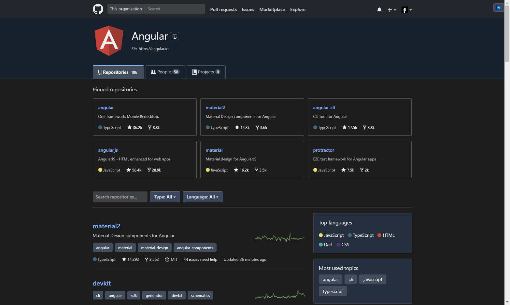

# github-dark-theme
Dark theme for Github.

This repository was fork from [doublehelix/Stylish-Themes](https://github.com/doublehelix/Stylish-Themes).

## Installing
Install browser extension: Stylish - get the addon for [Firefox](https://addons.mozilla.org/en-US/firefox/addon/2108/), [Chrome](https://chrome.google.com/extensions/detail/fjnbnpbmkenffdnngjfgmeleoegfcffe), [Opera](https://addons.opera.com/en/extensions/details/stylish/), [Safari](http://sobolev.us/stylish/) and [Firefox Mobile](https://addons.mozilla.org/en-US/firefox/addon/2108/).

Then install this style using: [userstyles.org](https://userstyles.org/styles/159909/github-dark-theme)

## Screenshots
### Profile overview 

### Profile Repositories

### Repository

### Organization

### Code highlight

### Commits

### Issues

